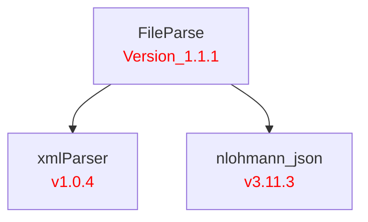

```mermaid
graph TD
    %% Package definitions
    xmlParser[xmlParser<br/><font color='red'>v1.0.4</font>]
    nlohmann_json[nlohmann_json<br/><font color='red'>v3.11.3</font>]
    FileParse[FileParse<br/><font color='red'>Version_1.1.1</font>]

    %% Package relations
    FileParse --> xmlParser
    FileParse --> nlohmann_json
```
